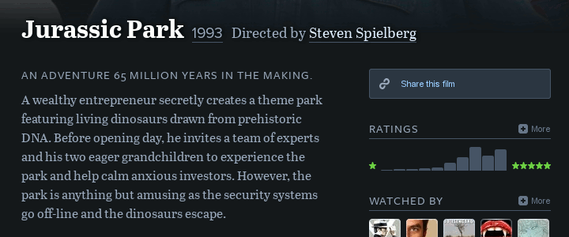
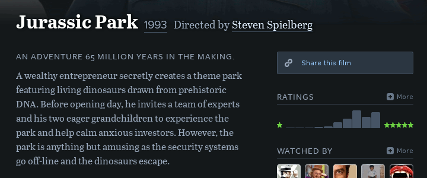
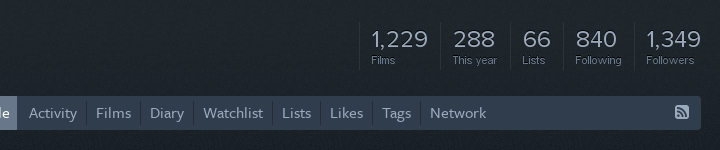

# User scripts for web browsers

This repository hosts a few user scripts I've written. These are little pieces of software that extend or modify the behavior or appearance of certain web pages. They need to be used with a user script manager, which is an add-on or extension for web browsers (check the [installation section](#installation)).

## For [Letterboxd](http://letterboxd.com/)

### Letterboxd Average Rating

Adds the average rating of a film to Letterboxd's film pages. It is presented with star icons above the rating histogram. Hovering over reveals the exact number of stars, as well as the equivalent one-to-ten rating.

### Letterboxd External Ratings

Adds ratings from external sites to Letterboxd's film pages ([IMDb](http://www.imdb.com/), [Metacritic](http://www.metacritic.com/) and [Rotten Tomatoes](http://www.rottentomatoes.com/) for now). You can toggle between the original ratings and their five-star scale equivalents. The state of the toggle is saved so all film pages will use whatever mode was last selected until you change it again. Links to the film on the external sites are provided as well.

### Letterboxd Backdrop Remover

Removes the backdrop image present at the top of most Letterboxd's film pages. This allows you to see more information of the film at a glance, reducing the need to scroll.

### Letterboxd Bio Modifier

Adds a little visual summary of biographical info to the bio section of Letterboxd's actors and directors pages. The summary includes place of birth, birth or death date, age and number of known credits of the person. A button to search for more info on Wikipedia is also added below the bio.

### Letterboxd Extra Profile Stats

Adds the average number of films watched per month and per week in the current year to the statistics displayed at the top of Letterboxd's profile pages. Note that although this is the same data displayed in the *Year in Review* page that is only available to Pro members, this script will work in all profile pages, irrespective of the kind of membership.

## For [Rotten Tomatoes](http://www.rottentomatoes.com)

### Rotten Tomatoes Reviews Redirect

Redirects Rotten Tomatoes's movie pages to their corresponding reviews pages, so that you can get to read them right away. Also, once in the reviews page, if you change the type of reviews the selection is saved, and all movie pages will redirect to reviews pages of that specific type until you change it again.

## Installation

1. If you don't have a user script manager, install one first. For Mozilla Firefox, get [Greasemonkey](https://addons.mozilla.org/firefox/addon/greasemonkey/). For Google Chrome, [Tampermonkey](https://chrome.google.com/webstore/detail/tampermonkey/dhdgffkkebhmkfjojejmpbldmpobfkfo) is the one you need. For other browsers, check [this page](http://wiki.greasespot.net/Cross-browser_userscripting).

2. Head over to [my OpenUserJS page](https://openuserjs.org/users/rcalderong/scripts) and click on the script you want to install. A new page will load with the details of the script. Click on the **Install** button.

3. Your user script manager will prompt you to confirm the installation.

## Compatibility

These scripts have been tested with [Greasemonkey](https://addons.mozilla.org/firefox/addon/greasemonkey/) on Mozilla Firefox and [Tampermonkey](https://chrome.google.com/webstore/detail/tampermonkey/dhdgffkkebhmkfjojejmpbldmpobfkfo) on Google Chrome, but they should work with pretty much any user script manager. If you find something not working properly, please [report the issue](https://github.com/rcalderong/userscripts/issues).

## License

These scripts are released under version 3 of the GNU General Public License (GPL v3). The full text of the license is available in the [LICENSE file](LICENSE).